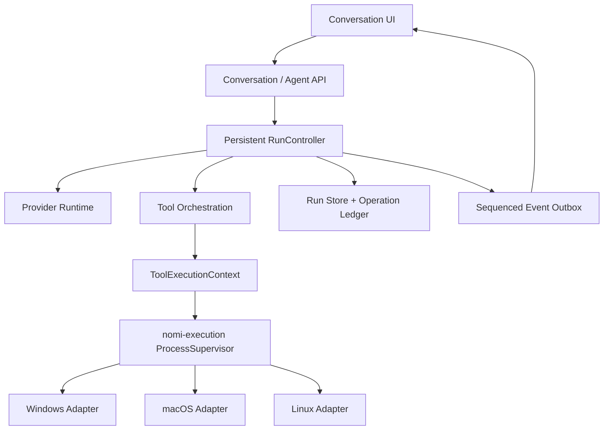

# Nomifun 跨平台命令执行与 Agent 可靠性重构设计

> 日期：2026-07-10
> 状态：总体设计已获用户确认，待书面审阅
> 范围：Windows、macOS、Linux；nomi Agent、进程内子 Agent、编排 worker、桌面会话、CLI 与相关 UI/事件链路

## 0. 决策摘要

本设计不再继续修补现有 `Bash`、`exec_command`、`write_stdin` 与多层 continuation 体系，而是完成两项架构收敛：

1. 新建共享的跨平台执行内核 `nomi-execution`，成为 Agent、Terminal、ACP 与 Orchestrator 的唯一受管进程入口。
2. 新建持久化 `RunController`，统一模型调用、工具执行、取消、重试、预算、循环检测、完成审计与恢复。

对模型只暴露一个 `exec_command` 工具。现有 `Bash` 与 `write_stdin` 的执行实现只保留到 Wave E；旧名称的隐藏纯解析别名长期保留并统一调用新内核，因此旧会话与旧技能仍可执行，但新模型上下文不再看到它们。

最终系统只保留一套执行语义和一套运行状态机，不长期维护新旧双轨。

## 1. 已确认的根因

### 1.1 进程生命周期与平台语义

- `BashTool` 使用 `tokio::time::timeout(Command::output())`。future 被丢弃后子进程默认继续运行，因此当前“命令已停止”的结果不真实，重试可能制造重复副作用。
- `exec_command` 与 `write_stdin` 对非零退出码仍返回 `is_error=false`；同一命令在不同工具中会得到相反的成功语义。
- Windows PTY 杀进程只覆盖直接子进程，不能可靠回收孙进程；仓库另一处 `nomifun-runtime` 已有 Job Object 与进程树清理实现，但 Agent 工具没有复用。
- Windows ConPTY 在子进程退出后不保证 master EOF，而当前收集器要求“已退出且输出关闭”才提前返回，导致快速命令等待完整 yield。实测立即退出命令仍耗尽显式 3 秒 yield。
- Windows PowerShell 重定向输出与工具的 UTF-8 解码不一致，会破坏中文；现有 PowerShell 退出码包装器也会同时产生假成功和假失败。
- 无效 `exec_command.workdir` 可被 PTY 依赖静默回退到用户目录，命令可能在错误目录执行。
- macOS Seatbelt 只绑定在 `BashTool` 路径，`exec_command` 和子 Agent 可绕过；子 Agent 同样没有完整继承父 Agent 的写入范围。
- 输出在进程完成后才截断，多条路径存在无界内存、尾输出竞态、静默丢历史和后台 session 无 TTL 等问题。

### 1.2 Agent 循环与完成判定

- Engine turn、goal continuation、宿主 MaxTokens/MaxTurns 续跑、provider retry、compaction retry、steering rerun 和 orchestrator retry 各自拥有独立预算，最坏情况下产生乘法放大。
- 单次 `engine.run()` 默认最多 200 turn，但宿主可重新调用并重置计数，默认路径可放大到 600 turn；HTTP retry 与 compaction 还不计入该数字。
- 当前完成条件本质上是“本轮没有工具调用”，不是“用户目标已完成”。MaxTokens、MaxTurns、缺失 terminal event、空流和部分解析失败都可能被当成成功。
- 循环检测只比较工具名与参数集合，不比较工具结果、外部状态或计划进度；合法的 `write_stdin` 轮询会误判，A/B 交替和语义等价命令却不会命中。
- guard 在第三次副作用执行后才提示，且状态会跨用户任务、clear、rewind、compaction 与宿主续跑残留。
- `ToolResult` 只有 `content/is_error/images`，无法表达 retryable、running、timeout、partial side effect、idempotency 或 lost。
- 原始工具参数用于审批与分类，规范化后的参数用于实际执行，存在“审批看到 A、执行变成 B”的契约裂缝。
- plan mode 只过滤发给模型的 schema，不在执行侧强制能力集合，不能作为安全边界。

### 1.3 取消、事件与恢复

- 取消令牌未覆盖 factory build、`provider.stream()` 初始等待、context contributor、compaction、审批、工具、hook 与子进程。
- 冷启动构建期间 cancel 可能返回成功，但任务构建完成后仍继续发送和执行。
- WebSocket 只有实时广播，没有 sequence replay 或 snapshot resync；断线时丢失 finish/error/permission 会让 UI 永久忙碌或出现内容缺口。
- Agent 广播通道无 terminal event 地关闭时会被合成为正常 Finish，掩盖崩溃和异常释放。
- 用户消息在 provider 调用前未可靠 checkpoint；session 文件直接覆盖写，损坏后可能静默从空上下文开始。
- 活跃 turn、确认请求和多项运行真相主要是内存态，重启后无法区分 running、waiting、interrupted 与 lost。
- orchestrator worker 超时后会重试，但旧 conversation 未先取消，可能形成两个 worker 同时产生副作用。
- 正常桌面退出只显式清理 Terminal，没有统一停止 ingress、取消 Agent、drain relay、checkpoint、停止 orchestrator 与 flush outbox 的 shutdown 协调器。

### 1.4 测试基线说明

现有 `nomi-tools`、`nomi-agent`、`nomi-providers` 及相关 integration tests 全部通过。它证明当前实现与既有测试一致，但不能证明可靠性；关键平台语义、真实延迟、进程树、取消、编码、断线、崩溃恢复、循环进度和副作用幂等性大多没有覆盖，部分错误行为甚至已被测试固定为预期。

## 2. 目标与非目标

### 2.1 目标

1. Windows、macOS、Linux 对相同请求给出相同的状态、退出码、取消、超时和输出语义。
2. 每个非 hand-off 进程在启动前获得明确 owner；任何退出路径最终都能确认进程树已退出或如实标记 `lost`。
3. 模型只需掌握一个命令工具，不再自行猜测 Bash/PowerShell/PTY/timeout 工具分工。
4. yield、stall 和 deadline 完全分离，长命令能持续运行且不阻塞 Agent。
5. 所有循环、重试、continuation、compaction 和 provider attempt 共享一份持久化预算。
6. 自动重试只发生在确定安全的情况下；副作用未知时先检查现场，绝不盲重跑。
7. 完成必须通过代码层 Completion Audit，不能只依赖模型停止输出。
8. 取消从 turn claim 开始贯穿全部子操作，并在 UI 中体现“请求停止”到“确认停止”的过程。
9. 断线、崩溃、重启和正常退出后，状态可解释、可恢复或可安全重新规划。
10. 父 Agent 的 capability、write root、sandbox、network/MCP 与审批策略必须向子 Agent 单调收敛。
11. 用户能看到当前阶段、命令、耗时、活动、重试原因、下一步和最终终止原因。

### 2.2 非目标

- 不尝试在应用进程崩溃后重新连接旧 OS 进程句柄。受管进程应由 OS 安全网清理，重启后旧 operation 标记为 `interrupted/lost` 并通过 ledger 恢复决策。
- 不通过解析任意 shell 文本来证明业务幂等性。无法证明时一律按“副作用未知”处理。
- 不把用户明确启动的 hand-off 应用、终端窗口或编辑器纳入自动回收；它们必须使用显式 hand-off API，模型命令工具无权请求 hand-off。
- 不依靠提示词承担 capability enforcement、plan mode、sandbox 或重试安全性。

## 3. 总体架构



### 3.1 `crates/shared/nomi-execution`

这是无业务数据库依赖的进程内核，供 agent 与 backend 两侧共同依赖。它负责：

- 请求规范化后的进程创建；
- pipe/PTY transport；
- stdout/stderr 增量读取、UTF-8 解码与有界缓冲；
- session registry 与 lease/reaper；
- cancellation、interrupt、terminate、wait/reap；
- 平台 owner 与父进程死亡安全网；
- 结构化 `ExecutionEvent` 与 `ExecutionOutcome`；
- capability policy 在进程创建边界的最终校验。

模块边界固定如下：

- `request.rs`：`ExecutionRequest`、transport、shell 与 policy。
- `outcome.rs`：状态、失败分类、副作用状态与 retry disposition。
- `supervisor.rs`：spawn、session、取消与回收。
- `registry.rs`：session lease、状态查询和 reaper。
- `io.rs`：有界 ring buffer、增量 decoder、stdout/stderr 顺序事件。
- `capability.rs`：不可变 `CapabilityPolicy`。
- `platform/windows.rs`、`platform/linux.rs`、`platform/macos.rs`：平台所有权与信号。

现有 `nomifun-runtime::Builder`、Job Object、process group、PDEATHSIG、macOS kqueue watchdog、PATH resolver 与 clean environment 能力迁移或下沉到该 shared crate；`nomifun-runtime` 改为薄封装和兼容 re-export，避免复制两套进程内核。

### 3.2 `ToolExecutionContext`

`Tool::execute` 改为接收统一上下文：

```rust
pub struct ToolExecutionContext {
    pub run_id: RunId,
    pub turn_id: TurnId,
    pub call_id: ToolCallId,
    pub cancellation: CancellationToken,
    pub budget: RunBudgetHandle,
    pub capability: CapabilityPolicy,
    pub progress: Arc<dyn ProgressSink>,
    pub journal: Arc<dyn OperationJournal>,
}
```

同一 token 必须向 provider、tool、hook、approval、context contributor、compaction 和子 Agent 派生 child token。工具不能通过 future drop 假装取消；它必须返回已确认的终态。

### 3.3 持久化 `RunController`

`RunController` 是唯一允许推进 Agent turn 的组件。它不直接依赖桌面数据库，而依赖 `RunStore`、`OperationJournal` 与 `EventSink` trait：

- Desktop 提供 SQLite + transactional outbox adapter。
- CLI 提供原子文件 journal adapter。
- 测试提供 deterministic in-memory adapter。

运行状态：

```text
Accepted
  -> Preparing
  -> Compacting
  -> RequestingModel
  -> Streaming
  -> ValidatingModelTurn
       -> NormalizingTool
       -> CapabilityCheck
       -> WaitingApproval
       -> ExecutingTool
       -> RecordingOutcome
       -> AssessingProgress
       -> RequestingModel
  -> CompletionAudit
       -> Completed
       -> WaitingInput
       -> Continue
       -> Failed
       -> Cancelled
       -> Interrupted
       -> Lost
       -> Blocked
       -> BudgetExhausted
```

其中 `Blocked` 是停止自动推进、可由新用户输入恢复的静止状态，不计为成功；`WaitingInput` 表示存在一项明确、可回答的审批或问题。

每次状态转换先持久化，再发有序事件。所有异常退出统一执行：

1. 关闭 dangling tool calls；
2. 取消并回收 owned work；
3. 保存 operation outcome 与 checkpoint；
4. 发出准确 terminal event；
5. 释放 turn claim。

## 4. 唯一模型工具：`exec_command`

### 4.1 对外 schema

`exec_command` 使用一个 action schema：

```json
{
  "action": "run | poll | write | close_stdin | interrupt | terminate | status",
  "program": "optional executable",
  "args": ["optional", "argv"],
  "command": "optional shell script",
  "shell": "none | auto | powershell | posix",
  "cwd": "optional path",
  "tty": false,
  "execution_kind": "auto | quick | build | test | install | server | interactive",
  "yield_time_ms": 1000,
  "session_id": "required by session actions",
  "chars": "required by write"
}
```

规则：

- `action` 缺省为 `run`。
- `run` 必须二选一：`program + args` 或 `command`。
- `program + args` 默认 `shell=none`，也是执行 native CLI 的首选形式。
- `command` 必须使用 `shell=auto/powershell/posix`；Windows auto 为 PowerShell，macOS/Linux auto 为 POSIX sh。
- `tty=false` 必须使用真实 pipe；只有交互程序才使用 PTY。
- `cwd` 先按 session cwd 锚定、规范化并验证；不存在、不是目录或越权时拒绝，绝不回退。
- `yield_time_ms` 只决定何时返回 `Running` handle，不终止进程。
- `execution_kind=auto` 由 deterministic classifier 根据 program、args、TTY 和已知命令类别选择 policy；模型声明只是提示，controller 有最终决定权。
- 新 `session_id` 使用不可预测的 UUIDv7，session owner 固定为 `run_id + original_call_id`。所有 session action 必须来自同一 run 且通过 capability 校验，不能通过猜测 id 操作其他会话。

### 4.2 兼容层

- 隐藏 `Bash` alias 接受旧 `command/timeout` 输入，映射到 `exec_command(action=run, command=..., execution_kind=auto)`；显式 legacy timeout 转成 `min(requested_timeout, remaining_run_deadline)`，不允许扩大 run 预算。
- 隐藏 `write_stdin` alias 映射到 `exec_command(action=write/poll)`。
- legacy `cmd`、`workdir` 和 numeric session id 在 adapter 中转换；新 schema 不再发布这些别名。
- Tool registry 增加“可执行但不向模型 offer”的 hidden alias，保证历史消息中的 pending tool call 可恢复。
- session schema 写入版本号；迁移期读取旧格式，所有新保存只写新格式。
- Wave E 删除旧执行实现。读取旧 session/tool name 的纯解析适配器长期保留；它只转换输入并调用新内核，不构成第二条执行路径。

### 4.3 shell 与编码契约

- 内部路径和环境使用 `PathBuf/OsString`，不以 `to_string_lossy` 参与执行。
- pipe 与 PTY 都向上层输出合法 UTF-8 事件。Windows PowerShell 在启动时显式设置 console、pipeline 与重定向编码为 UTF-8；其他 native pipe 先严格尝试 UTF-8，再按平台编码策略解码。decoder 必须支持多字节字符跨 chunk，并在 metadata 中报告 `source_encoding/decode_errors`；无法无损解码的原始字节在输出预算内保留，不能静默替换后假装完整。
- stdout/stderr 保持事件顺序和 stream identity，不再拼成“全部 stdout 后全部 stderr”。
- PowerShell script 使用 PowerShell 自身“脚本最终状态”语义；不再读取可能陈旧的全局 `LASTEXITCODE` 猜测整个脚本是否失败。
- native CLI 优先使用 `program + args`，退出码由目标进程直接提供。依赖步骤建议使用结构化的多次 tool call，由 controller 在前一步成功后再发起下一步，而不是把多条有副作用命令塞进一个 shell 字符串。
- 输出达到上限时在读取阶段丢弃旧数据并记录准确的 `dropped_bytes`，绝不先无界收集再截断。

## 5. 跨平台进程所有权

共同不变量：任何非 hand-off spawn 在用户代码开始运行前必须成功建立 owner；建立失败则 spawn 失败，不能静默降级为无监管进程。

主动取消的总 SLA 为 5 秒：最多 1 秒 graceful interrupt、最多 1 秒 terminate grace，随后 force kill 并在剩余 3 秒内 wait/reap。平台不支持某一级信号时跳过该级但不扩大总 SLA；5 秒后仍不能证明平台 owner 的 containment boundary 已清空则 operation 进入 `Lost`。

### 5.1 Windows

- 非 PTY 与 ConPTY 均由可控的 Win32 adapter 创建。
- 使用 `CREATE_SUSPENDED` 创建进程，先分配 execution-scoped Job Object，再恢复主线程，关闭“子进程抢先逃逸”窗口。
- execution Job 使用 `JOB_OBJECT_LIMIT_KILL_ON_JOB_CLOSE`，其 handle 由父进程的 supervisor 持有。单次取消显式关闭对应 Job；宿主崩溃/强退时 OS 自动关闭父进程持有的全部 Job handle，因此不再嵌套第二个应用级 Job。
- graceful interrupt、hard terminate 和 wait 分开建模。不能发送可靠 graceful signal 时如实跳到 hard terminate。
- ConPTY close 在可能阻塞的平台版本上由专用 cleanup worker 隔离，并受 deadline 约束；不能让 async runtime 或 UI 线程无限阻塞。
- 所有 handle 使用 RAII，最终状态必须包含 Job/leader/descendant 的回收结果。

### 5.2 Unix containment boundary

Unix process group 不是 Windows Job 或 Linux cgroup：后代可以主动调用 `setsid`/`setpgid` 逃离。因此 Linux/macOS 的基础 owner 只对初始 owned process group 作强保证，不能把“PGID 已清空”描述成“任意 daemonized descendant 已消失”。发现 escaped descendant（例如仍持有输出管道）或无法证明边界清空时必须返回 `Lost`；真正 hand-off 只能走未来独立 API。Linux 可在具备可信 cgroup v2 delegation 时增加更强 containment，但 macOS 普通 PGID 没有等价的不可逃逸保证。

两平台共用以下协议：

- 每次执行先创建一个由宿主直接拥有、正常路径可显式 reap 的 watchdog；不使用 detached/double-fork orphan。
- watchdog 先建立宿主进程级监控并发出 `BOOT_READY`，user child 才能 fork。child 在 `pre_exec` 中建立独立 group、用 nonce 注册精确 PID/PGID，并等待 watchdog ACK；ACK 之前用户代码不得执行。
- Rust `Command::spawn` 返回 `Ok` 后宿主必须发送 `COMMIT` 并收到 `COMMITTED` 才能交付 owner；exec 失败发送 `ABORT`，避免 watchdog 对已经由 Rust 回收的失败 child 使用旧 PGID。
- watchdog 与 owner 之间保留 health/control channel。ACK 后 watchdog 异常退出时 owner 立即停止 group，并把终态标记为 `Lost`。
- watchdog 观察 leader exit 后，在 leader 尚未 reap、身份仍锚定时完成最后一次 group `SIGKILL` 并退出；唯一 waiter 先 reap watchdog、关闭 signal gate，再 reap leader。leader reap 后只允许无副作用的 group existence probe，禁止再次向裸 PGID 发信号；任何不确定性都保守为 `Lost`。
- child `pre_exec` 只调用 async-signal-safe 原语并只关闭协议明确拥有的 FD，绝不能全量关闭未知 FD（Rust 自己的 exec-error pipe 也在其中）。watchdog fork branch 则使用经过审计的 raw-syscall loop，重定向标准流并关闭全部非协议 FD。
- `SpawnFailed` 只表示已证明用户代码没有执行且 command/watchdog/FD 均已清理；越过 ACK/exec 边界后所有权交付或清理未证明时返回 `StartLost`，禁止自动重试。

### 5.3 Linux

- child 成为独立 process group leader。
- 不使用 `PR_SET_PDEATHSIG` 作为正确性条件：该原语监视创建 child 的 OS 线程，任意 Tokio worker 退出会在宿主仍健康时误杀命令。进程级 direct-child watchdog 与 ownership health channel 取代它。
- watchdog 优先用 pidfd 监视宿主与 child identity；只有明确不支持 pidfd 时才使用包含 `/proc/<pid>/stat` start time/state 的身份校验。`/proc` 不可用或身份不可信则 fail closed，绝不退化为裸 `kill(pid, 0)`。
- 停止顺序为 `SIGINT -> SIGTERM -> SIGKILL`，每步有短 grace period，最终按共同两阶段协议 wait/reap。

### 5.4 macOS

- child 成为独立 process group leader。
- direct-child watchdog 自行创建 kqueue，严格注册宿主与 child 的 `EVFILT_PROC | NOTE_EXIT` 后才发 READY/ACK；正常路径由 owner 显式 reap。
- Seatbelt profile 在执行内核边界应用，所有 pipe、PTY、兼容 alias 与子 Agent 使用同一个 policy。
- sandbox 请求若无法建立必须 fail closed；只有明确的 unrestricted local-owner policy 可以无 sandbox 执行。
- 停止顺序与 Linux 一致，最终按共同两阶段协议证明 owned group 已终止。

## 6. 结构化结果与工具编排

### 6.1 结果类型

`ExecutionOutcome` 属于 `nomi-execution`，只描述 OS 进程事实；下列 `ToolOutcome` 属于 `nomi-types`，由工具把执行事实、权限、审批和副作用语义映射后交给 Agent。两层不得互相依赖。

```rust
pub enum ToolOutcome {
    Succeeded(OutcomeMetadata),
    Running { session_id: SessionId, progress: ProgressSnapshot },
    Failed { class: FailureClass, retry: RetryDisposition, side_effects: SideEffectState },
    Denied { reason: DenialReason },
    Cancelled { reason: CancelReason },
    TimedOut { kind: TimeoutKind, side_effects: SideEffectState },
    Lost { last_known: ProcessSnapshot },
}
```

`FailureClass` 至少包括：

- `Spawn`
- `CommandExit`
- `InvalidWorkingDirectory`
- `CapabilityMissing`
- `PermissionDenied`
- `Transport`
- `ProviderTransient`
- `ProviderPermanent`
- `OutputLimit`
- `Protocol`
- `Internal`

`SideEffectState` 为 `None/Committed/Partial/Unknown`。
`RetryDisposition` 为 `Never/AfterInspection/SafeAfter/RetryAfter`。

现有 `is_error` 由 typed outcome 派生，只保留为 provider/tool protocol 的兼容字段。非零退出必须是 `Failed(CommandExit)`；`Running` 是非终态，必须阻止同一 assistant batch 中依赖它的后续调用。

### 6.2 参数处理顺序

工具输入只规范化一次，随后同一个 immutable value 依次用于：

1. JSON Schema validation；
2. capability 与 plan-mode enforcement；
3. category 与 side-effect classification；
4. approval 展示；
5. canonical hash 与 loop fingerprint；
6. operation ledger preflight；
7. 实际 execute。

本轮没有 offer 的工具在执行层拒绝。plan mode 的 capability set 是运行时强制边界，ExitPlanMode 转入 `WaitingInput`，必须等真实用户批准后才恢复 edit/exec。

### 6.3 并发批次

- independent read-only 调用可并发。
- 任何 exec、edit、write 或未知副作用调用默认按同一 workspace mutation domain 串行。
- 并发结果通过 `FuturesUnordered` 边完成边记录，不能因一个挂起工具阻塞所有已完成结果。
- 一项失败不能撤销已启动的并发副作用，因此 planner 应只把真正 independent 且 concurrency-safe 的调用放在同一批。
- 结果按 call id 关联，UI 可按完成时间显示；回注模型时保持原 tool-use 顺序并包含每项真实状态。

## 7. 时间、预算与重试

### 7.1 三种时间语义

- `yield`：响应性边界。默认 1000ms；命令未结束则返回 `Running`，进程继续受管。
- `stall`：无可观察进展。它触发状态检查、诊断和重新规划，不因“没有 stdout”单独杀掉仍存活的 quiet build。
- `deadline`：run 的总 wall budget。耗尽时 controller 取消 owned work，确认回收后进入 `BudgetExhausted`。

默认 command policy：

| 类型 | 初始 yield | command deadline | session idle lease |
|---|---:|---:|---:|
| quick | 1s | 2m | 2m |
| build/test/install | 1s | 30m | 15m |
| server/interactive | 500ms | 继承 run deadline | 15m 无 owner 活动 |

显式 host/orchestrator deadline 可以收紧这些值，不能由模型扩大 run 总预算。所有值进入配置并写入 run checkpoint，恢复后不重新计时。

“owner 活动”包括所属 run 的有效 lease heartbeat、用户/session action 和 process output/activity；只要 run 仍持有该 session，就不会因模型暂时未 poll 而误杀 quiet server。

### 7.2 共享 `RunBudget`

默认普通桌面 turn：

- wall deadline：60 分钟；
- logical model turns：最多 200，跨 continuation 保持同一计数；
- provider transient retries：整个 run 最多 20，每个 logical request 最多 2 次重试；
- safe tool retries：每个 operation 最多 2 次、整个 run 最多 10 次；
- goal continuations：最多 3 次，计入 logical turns；
- compactions：最多 6 次，usage 与成本计入 run；
- tool actions：最多 400。

subagent 默认 wall deadline 30 分钟；orchestrator worker 使用 run 指定 deadline，但仍共享其余预算语义。达到任何硬预算都返回明确的 `BudgetExhausted { dimension }`，不能转成普通 EndTurn。

### 7.3 重试矩阵

允许自动重试：

- 连接建立失败、明确 429/5xx、Retry-After、短暂 transport error；
- operation 明确未启动；
- read-only 或声明幂等的工具；
- 已有 idempotency key 且 ledger 证明前次未提交。

禁止盲重试：

- 命令非零退出；
- timeout/cancel 后 side effect 为 `Partial/Unknown`；
- edit/write/migration/delete/send/payment 等 mutation；
- provider 已产生 partial content 或 partial tool args；
- session/process 状态为 `Lost`。

禁止盲重试时，controller 先执行 inspection：读取 operation ledger、查询进程状态、检查产物或运行验证命令。只有 side effect 被证明为 `None`，或新的 operation 有不同 precondition/idempotency key 时，才可继续。

provider retry 统一识别 initial 与 midstream 的 429/5xx，遵守 Retry-After 并使用带 jitter 的退避；400/401/403/schema/auth/billing 不重试。取消 token 必须中断 backoff 和 in-flight HTTP。

## 8. 进度、循环检测与完成审计

### 8.1 Progress fingerprint

每次工具结果后记录：

- objective/plan revision；
- normalized action sequence；
- typed outcome fingerprint；
- operation/side-effect state；
- external state version 或验证摘要；
- running session output/activity cursor。

合法轮询满足“进程仍活跃且 cursor、output 或状态发生变化”时不计 stagnation。检测窗口覆盖周期长度 1 至 5，可识别 A/B 与 A/B/C 循环；显式默认值与省略默认值、路径规范化和无意义空白使用 canonical form。

升级策略：

1. 第一次无进展：要求读取并解释结果。
2. 第二次：强制 replan，禁止立即重复相同 mutation。
3. 第三次：要求替代工具、替代命令或 capability discovery。
4. 仍无进展：进入 `WaitingInput` 或带证据的 `Blocked`，停止自动消耗。

guard 在新用户 turn、clear、rewind 与显式新 objective 时 reset；compaction 和 crash resume 不丢失当前 run guard。

### 8.2 Completion Audit

模型的自然停止只是候选完成。controller 只有在以下条件全部满足时才能写 `Completed`：

- provider stream 有且只有一个合法 terminal event；
- 没有 running process、pending approval 或 unresolved input request；
- 所有 tool calls 都有持久化终态；
- operation ledger 没有 `Partial/Unknown` 未处理项；
- plan 没有 pending/in-progress step；
- goal 没有未满足 acceptance criterion；
- mutation 任务存在对应验证证据；
- run budget 与 event outbox 已 checkpoint。

缺 Done、clean EOF、MaxTokens、MaxTurns、空响应和 partial parse 均不是完成。controller 按状态选择继续、重试、等待用户、失败或预算耗尽。

goal 的 complete/blocked 由 controller 校验；模型只能提出状态转换。blocked threshold、证据与完成门槛由代码执行。

## 9. 持久化、事件与恢复

### 9.1 数据模型

新增以下持久化实体，不复用语义不相同的 orchestrator 表：

- `agent_runs`：run/turn id、conversation、state、budget、lease、heartbeat、objective、plan revision、checkpoint、terminal reason。
- `agent_operations`：call id、canonical hash、capability、side-effect class、attempt、process/session metadata、outcome、verification。
- `agent_input_requests`：approval/question、state、answer 与 expiry。
- `agent_events`：run 内单调 sequence、event kind、payload 与 created_at。
- transactional outbox cursor：保证 DB 状态和可重放事件同事务提交。

用户消息、run row 与首个 outbox event 在同一事务接受。Nomi session/checkpoint 使用 temp + flush + fsync + atomic rename，并保留上一版本；读取损坏不能静默 starting fresh，必须尝试 previous version 或从 conversation DB 重建 transcript，并发出 `recovery_failed` 诊断。

state、approval、operation 与 terminal 事件逐项持久化；高频 text/output delta 允许按 100ms 或 64 KiB 中任一先到条件批量提交，terminal 前必须强制 flush。事件 replay 数据在 run 终态后保留 7 天；长期会话正文仍以 conversation message 为真源，过期事件压缩为最终 snapshot 后删除，避免事件表无界增长。

### 9.2 WebSocket 重连

- 每个事件携带 `run_id + seq`。
- 客户端保存最后确认 seq，重连后请求 replay。
- replay 窗口不足时 GET run snapshot，再从 snapshot seq 继续。
- lagged、closed、missing terminal 和 heartbeat expiry 都进入 `Interrupted`，禁止合成 Finish。
- UI reducer 以 snapshot 为权威，live event 只做增量更新。

### 9.3 启动与退出协调

启动 reconciliation：

- 扫描非终态 run；
- 确认旧 lease 已过期；
- 旧 owned process 应已被平台安全网清理；
- executing operation 转为 `Interrupted/Lost`；
- 根据 side-effect state 决定 inspection、等待用户或安全继续；
- waiting approval 从持久化 input request 恢复。

桌面 ShutdownCoordinator：

1. 停止新 ingress；
2. 标记 active runs 为 cancel requested 或 interrupted-on-shutdown；
3. 取消 provider、tool、subagent 与 orchestrator worker；
4. 等待进程树清理和 relay drain；
5. checkpoint session/run/ledger；
6. flush outbox、DB 与 tracing；
7. 超过总 shutdown deadline 时如实持久化未完成项，交给下次 reconciliation。

orchestrator worker timeout 必须先 cancel 旧 conversation 并等待 terminal，之后才允许创建新 attempt。operation idempotency key 至少包含 `run_id/task_id/attempt/call_id`。

## 10. Capability 与安全

`CapabilityPolicy` 是不可变值，包含：

- allowed tool/action set；
- write roots 与 cwd root；
- shell/exec permission；
- Seatbelt/sandbox profile；
- network、MCP、browser、secret access；
- approval policy；
- maximum child delegation depth。

子 Agent policy 必须为 `parent ∩ role ∩ surface`，任何维度只能收紧不能扩大。registry 不再从“空 allowlist = 全开”重建默认权限。

process supervisor 在 spawn 边界再次验证 capability、cwd 与 sandbox，防止上层遗漏。plan mode、remote surface 与 channel workspace 限制都映射为同一个 policy。

## 11. 用户体验与可观测性

会话 UI 展示统一 timeline：

- 当前阶段：准备、请求模型、执行命令、等待输入、验证、停止中、恢复中；
- command preview、cwd、transport、PID/session、elapsed 与最近活动时间；
- output dropped bytes 与 truncation；
- retry 原因、attempt、下一次时间和预算余额；
- timeout 类型与 side-effect state；
- cancel requested、graceful interrupt、force terminate、reaped；
- completion/blocked/interrupted/lost 的明确原因和建议动作。

并发工具边完成边显示，不等待整批结束。首次 send 失败、WS 重连和 snapshot 恢复必须重置或恢复 busy state，不能由前端猜测。

新增脱敏诊断包：

- 应用版本、OS/架构、shell 与 capability profile；
- run state、seq gap、budget、operation status；
- PID/exit code/signal/cleanup result；
- session load/recovery error；
- 相关 trace id 与有限日志窗口。

诊断包默认不含 prompt、密钥、命令输出全文或用户文件内容。

## 12. 实施波次

### Wave A：共享执行内核

- 建立 `nomi-execution` 与平台 adapters。
- 下沉 `nomifun-runtime` 的正确 spawn/kill primitives。
- 建立 pipe、PTY、有界 I/O、session registry 与真实进程树测试。
- 先迁移 `BashTool`/exec internals 使用内核，但暂不改变模型 schema。

验收：三平台进程树、退出码、编码、cwd、快速退出、取消和大输出测试通过。

### Wave B：统一工具协议

- 引入 `ToolExecutionContext` 与 typed outcome。
- 上线单一 `exec_command` action schema。
- 隐藏 `Bash/write_stdin` alias。
- 规范化一次、runtime capability enforcement、并发结果流式记录。

验收：所有旧调用方兼容，新模型只看到一个命令工具；非零退出和 Running 正确阻断依赖调用。

### Wave C：RunController 与共享预算

- 把 engine loop、goal continuation、宿主续跑、provider retry 和 compaction 纳入 controller。
- 上线 progress fingerprint、cycle detection 与 Completion Audit。
- 所有 cancellation path 接入 root token。

验收：循环、合法 polling、MaxTokens/MaxTurns、缺 Done、approval cancel、provider retry 故障注入通过。

### Wave D：持久化恢复与 UI

- 上线 run/operation/input/event store 与 transactional outbox。
- WebSocket replay/snapshot、session atomic checkpoint、启动 reconciliation。
- UI timeline、停止过程、retry/timeout/lost 状态和诊断包。
- ShutdownCoordinator 与 orchestrator cancel-before-retry。

验收：断线、崩溃、重启、正常退出、旧 worker 重试与副作用幂等测试通过。

### Wave E：收口与删除旧路径

- 迁移剩余 Terminal/ACP/Orchestrator process spawn。
- 删除旧 PTY、ProcessStore、Bash execution、分散 retry/continuation 与假 Finish 路径。
- 清理 feature flags 与过渡代码，仅保留 legacy input/session adapter。
- 全量性能、资源和打包应用 smoke。

验收：workspace 中没有第二套非 hand-off spawn/timeout/kill 实现；架构依赖测试阻止回归。

每个 wave 必须保持 workspace 可编译、可测试；不允许通过长期 feature flag 让新旧引擎同时承接生产请求。

## 13. 测试与发布门槛

### 13.1 跨平台 CI

PR 门禁：

- Windows latest；
- macOS 14；
- Ubuntu 24.04；
- Rust nextest/cargo test；
- Bun/Vitest、typecheck 与 production build；
- architecture dependency checks。

nightly/release smoke 增加 Windows 10/11 pre-24H2、Windows 11 24H2+ 与真实打包桌面应用。

### 13.2 必测矩阵

进程：

- exit 0、非零、spawn fail、signal、timeout、cancel、host exit；
- 直系、孙进程、忽略 graceful signal、后台继承管道；
- pipe、PTY、close stdin、interrupt、terminate、session TTL。

I/O：

- CJK、emoji、跨 chunk UTF-8；
- stdout/stderr 交错；
- 超过 4 MiB、持续 flood、deadline 最后一字节；
- dropped byte count 与内存上限。

路径与环境：

- 绝对/相对/空/不存在 cwd；
- 空格、Unicode、边缘空白；
- PATH、PATHEXT、`.cmd/.ps1` shim；
- 非 Unicode Unix env/path。

Agent：

- 同一 poll 十次且持续进展，不触发 loop；
- 无进展相同动作、A/B、A/B/C；
- 相同调用不同顺序和 multiplicity；
- mutation 在第三次前被拦截；
- new turn/reset/compact/resume guard。

Provider：

- connect timeout、500 后成功、429 + Retry-After、400 不重试；
- empty stream、partial stream、malformed SSE、缺 Done、重复 Done；
- cancellation during connect/read/backoff/compaction。

恢复与安全：

- cancel during cold build；
- WS 在 start/text/approval/finish 处断开并重放；
- crash before provider、stream 中、tool side effect 后、waiting approval；
- session 截断、DB/outbox failure；
- parent/child capability containment 与 macOS sandbox 无旁路；
- orchestrator timeout 后旧 worker 已退出且无重复副作用。

### 13.3 硬指标

- child exit 被观察后 250ms 内返回终态，不再等待剩余 yield。
- cancel 后 5 秒内进程树全部消失；无法证明时状态必须为 `Lost`，不得标 `Cancelled`。
- 非零退出永远不是 success。
- CJK/emoji 精确往返。
- 单 operation 输出内存受配置硬上限约束，并报告 dropped bytes。
- 应用重启后所有非终态 run 都进入可解释状态，没有静默 Finish 或 starting fresh。
- 同一 mutation 在 outcome 未知时不会自动执行第二次。
- 合法 polling 不误报 stagnation，长度 1–5 的无进展循环在预算耗尽前终止。
- WS 重连后 snapshot + replay 与服务端最终状态一致。

## 14. 完成定义

本项目只有在以下条件全部满足时才完成：

1. 五个 wave 的代码和迁移均落地；
2. 三平台 PR CI、扩展平台 nightly 与打包 smoke 通过；
3. 所有 P0/P1 根因有对应故障注入回归测试；
4. 旧执行路径和分散控制循环已删除；
5. 文档、配置、诊断与 UI 使用同一状态词汇；
6. 没有已知 sandbox/capability 旁路、孤儿进程或假成功路径；
7. 代码审查确认资源、并发、恢复、幂等性和平台适配不变量。
